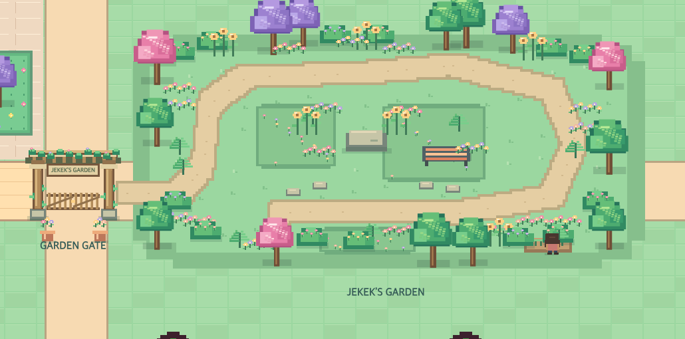
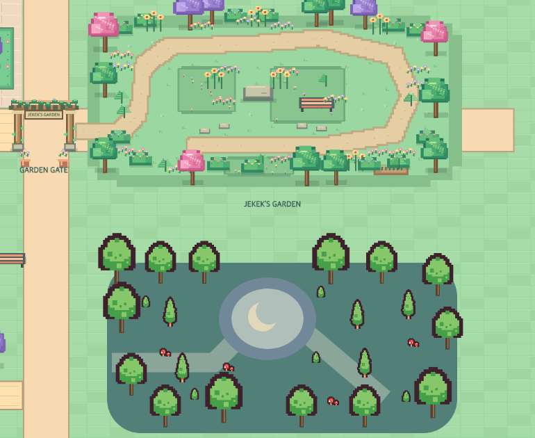

# World refresh and asset selection

Jekek’s Garden and its gate now use original procedural pixel art, matching the existing town palette, stepped shapes and wooden details. Garden trees reuse the town renderer. Custom flowering hedges, ferns, sunflowers, low flower clusters, pots, nursery seedlings and planted islands frame the open trail. The gate is a vine-covered wooden pergola with a nameplate, stone feet and animated picket leaves.

The local [Kenney Tiny Town 1.1](https://kenney.nl/assets/tiny-town) CC0 atlas remains limited to Dream Grove trees, shrubs and mushrooms. No external tile assets are used by the garden or gate.

This preview is a static render of production world drawing code, not a browser screenshot. It excludes dynamic NPCs, butterflies, creatures, gate leaves, night effects and game HUD.

[Superpowers football-player sprites](https://opengameart.org/content/football-player-overworld-sprite-sheet) were inspected and rejected because their helmets suit American football. [looneybits soccer assets](https://opengameart.org/content/basic-soccer-pack) use vector art that does not match this world. The existing configurable avatar system therefore supplies soccer bodies and animated action poses; Messi/Yamal retain recognizable kits, and the visitor retains their chosen clothes. User-supplied creature designs remain the reference.

No paid assets were purchased; no hotlinking or CDN dependencies were added. Original CC0 license is in `public/assets/tiny-town/LICENSE.txt`.

## Implemented behavior

- Garden/grove composition, planted beds, winding trail, rest bench, moon court, original wooden pergola and animated gate leaves.
- Walking/watering gardener, butterflies, birds, limited fireflies and Darkrai wisps; six football spectators react to goals.
- Two opposing teams, eight players, one fixed-step ball model, variable match outcomes, real crossing-based scoring and visible restarts.
- Join Messi/Yamal with visitor avatar and compact peripheral controls, separate practice lane, responsive camera, Escape to leave.
- Intact Darkrai sprite, snake angle hysteresis/proximity rest, action-facing priority, pose frame caching, offscreen snake render culling.
- Correct atlas aspect/legend/discoveries, short district/NEW notifications, footsteps and match sounds controlled by existing music toggle.
- Existing local progress retained; backend unchanged.

## Validation boundary

Automated checks verify navigation, snake motion, local economy persistence and football simulation. Static world renders were inspected directly. No browser or device interaction test was performed during this implementation, respecting the user's earlier instruction. Native mobile layout and touch behavior still need human play-through.
